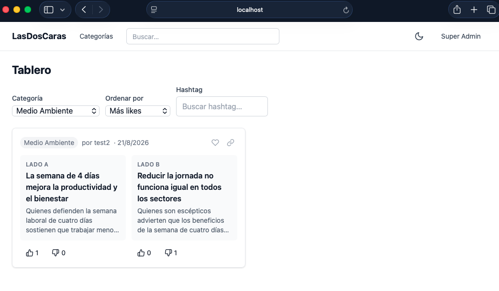
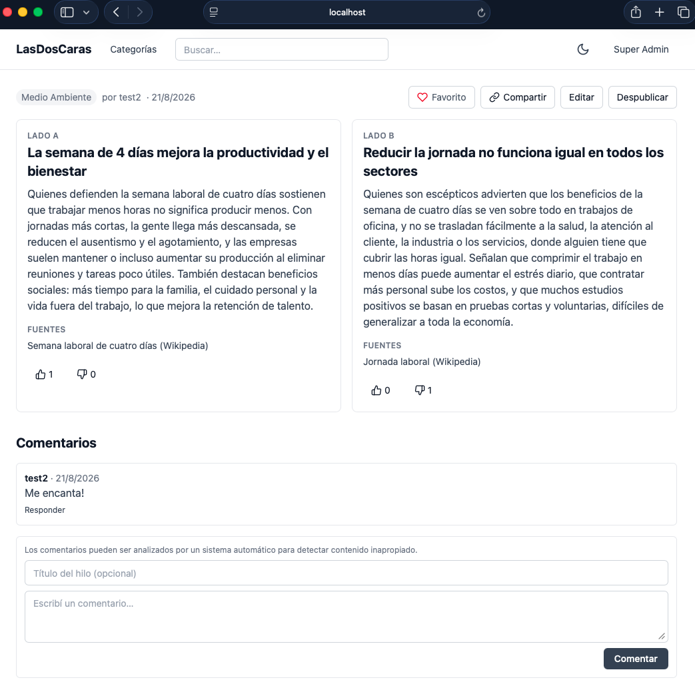
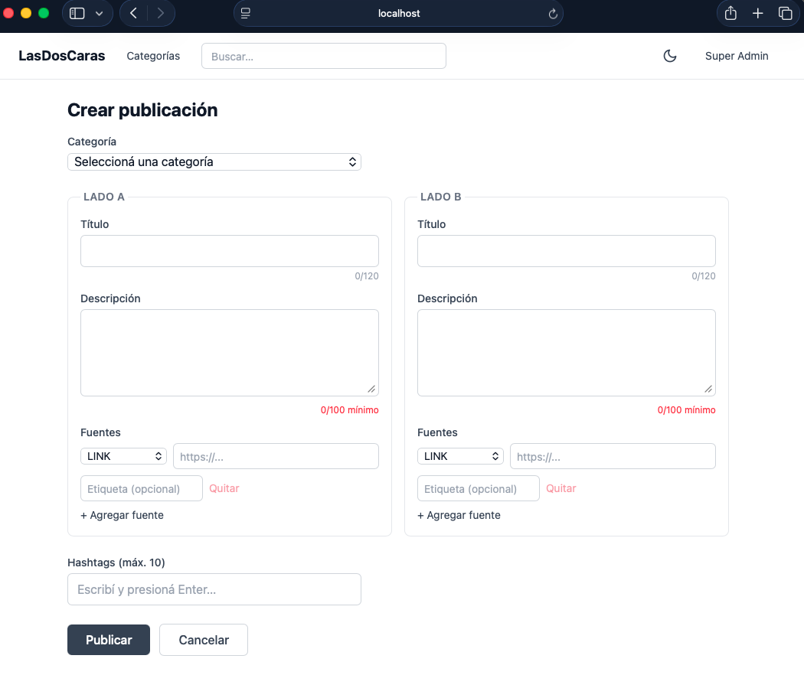
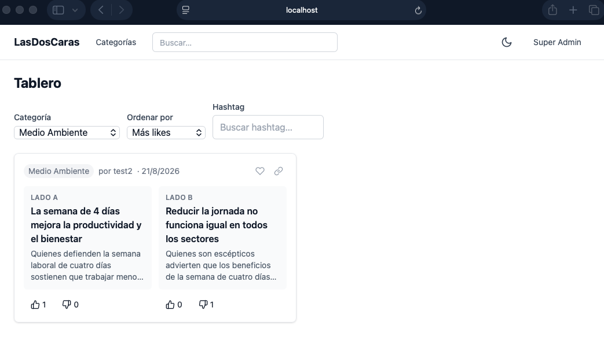

# LasDosCaras

Proyecto académico para la materia ISW-521 (UTN). LasDosCaras es una SPA
(single page application) que presenta **siempre dos narrativas** de un
mismo tema (social, político, económico, cultural). Cada publicación tiene
**Lado A** y **Lado B**, cada uno con su propio título, descripción, fuentes,
likes y dislikes — tratados como entidades independientes en toda la
interfaz, nunca fusionados en un único punto de vista.

## Integrantes

- Cristopher Leon
- Josue Vargas
- stephzam96-prog

## Stack tecnológico

- **React 19 + TypeScript** (modo estricto)
- **Vite** como build tool
- **Tailwind CSS**, diseño mobile-first, con tema claro/oscuro
- **React Router** con guards de autenticación y de rol
- **Context API + useReducer** para el estado global de autenticación
- Capa de servicio centralizada (`src/services/`) para toda llamada al API —
  no hay `fetch` suelto dentro de componentes
- Autenticación por JWT (header `Authorization: Bearer <token>`)

## Instalación y ejecución local

Este repositorio contiene **solo el frontend**. El backend (API REST +
JWT, provisto por la cátedra) corre en **Docker, en forma local**, y **no
forma parte de este repositorio** — cada persona que quiera correr el
proyecto debe levantar su propio backend por separado antes de continuar.

1. Instalar dependencias:

   ```bash
   npm install
   ```

2. Configurar las variables de entorno: copiar `.env.example` a `.env` y
   ajustar la URL del backend si hace falta (por defecto apunta a
   `http://localhost:3000/api`, que es donde queda expuesto el backend en
   Docker corriendo localmente):

   ```bash
   cp .env.example .env
   ```

3. Levantar el servidor de desarrollo:

   ```bash
   npm run dev
   ```

   La aplicación queda disponible en `http://localhost:5173`.

Con el backend en Docker corriendo y el `.env` apuntando a su URL, la SPA
queda completamente funcional (login, publicaciones, comentarios, admin,
etc.).

## Credenciales de prueba (superadmin)

Para poder evaluar las pantallas de administración (`/admin/users`,
`/admin/categories`, `/admin/moderation`) sin necesidad de crear una cuenta,
el backend en Docker viene con un usuario superadmin ya sembrado (seed) por
defecto:

- **Email:** `admin@doscaras.dev`
- **Contraseña:** `ChangeMe123!`

Son las credenciales de seed del backend Docker (compartidas por la cátedra
para todo el curso), no algo que se genere por integrante ni por instalación.

## localStorage — qué persiste la app y por qué

Toda la persistencia local pasa por un único módulo, `CacheService`, que es
el **único** lugar del código que llama `localStorage.getItem`/`setItem`
directamente. El resto de la app nunca accede a `localStorage` a mano. Usa
el patrón *stale-while-revalidate*: se muestra lo que ya está cacheado de
inmediato, y en paralelo se refresca en segundo plano contra el API.

| Clave | Qué guarda | Por qué |
|---|---|---|
| `lasdoscaras_auth` | El token JWT y los datos del usuario logueado | Mantener la sesión iniciada entre recargas de página, sin pedir login de nuevo cada vez. Se borra al hacer logout o si el backend responde 401 (sesión expirada). |
| `lasdoscaras_categories` | El listado de categorías | Sirve como respaldo si el API no responde, para que el tablero y los filtros no queden vacíos. Se refresca cada 1 hora. |
| `lasdoscaras_hashtags` | Hashtags para autocompletado | Evita pedirle al API la lista completa de hashtags cada vez que alguien escribe una publicación. Se refresca cada 30 minutos. |
| `lasdoscaras_filters` | Filtros y orden activos del tablero | Recordar cómo dejó configurado el tablero la última vez, sin tener que reconfigurarlo en cada visita. |
| `lasdoscaras_favorites` | IDs de publicaciones marcadas como favoritas | Guarda los IDs favoritos para mostrarlos en la pantalla de Perfil sin depender de una llamada extra al API ahí. |
| `lasdoscaras_draft` | Borrador de una publicación en curso | Evitar perder texto ya escrito si se cierra la pestaña o se navega fuera antes de publicar. |
| `lasdoscaras_theme` | Preferencia de tema (`"light"` o `"dark"`) | Que la app recuerde el tema elegido entre sesiones. |
| `lasdoscaras_history` | Las últimas 20 publicaciones vistas | Mostrar un historial de navegación reciente sin pedírselo al backend. |

## Estructura del proyecto (resumen)

```
src/
├── components/   # componentes reutilizables (Tarjeta, Navbar, Toast, etc.)
├── pages/        # una carpeta por pantalla/ruta
├── services/      # capa de servicio HTTP + CacheService
├── context/       # AuthContext + reducer de autenticación
├── hooks/         # custom hooks (useDebounce, useAuth, etc.)
├── types/         # interfaces TypeScript de las entidades del API
├── routes/        # AppRoutes, AuthGuard, RoleGuard
└── utils/
```

Cada pantalla vive en su propia carpeta dentro de `pages/`, y consume el API
exclusivamente a través de su servicio correspondiente en `services/`. Para
el detalle completo ver `estructura-carpetas.md`.

## Capturas de pantalla

| Tablero Principal | Detalle de Publicación |
|---|---|
|  |  |

| Crear/Editar Publicación | Panel Superadmin |
|---|---|
|  |  |

## Rutas principales

| Ruta | Pantalla | Acceso |
|---|---|---|
| `/` | Tablero Principal | Público |
| `/login` | Login | Solo no autenticados |
| `/register` | Registro | Solo no autenticados |
| `/auth/activate/:token` | Activación de Cuenta | Público |
| `/categories/:id` | Página de Categoría | Público |
| `/views/:id` | Detalle de Publicación | Público |
| `/views/new` | Crear Publicación | Autenticado |
| `/views/:id/edit` | Editar Publicación | Autenticado (autor o superadmin) |
| `/profile` | Perfil de Usuario | Autenticado |
| `/search` | Resultados de Búsqueda | Público |
| `/authors/:id` | Perfil Público de Autor | Público |
| `/admin/users` | Gestión de Usuarios | Solo superadmin |
| `/admin/categories` | Gestión de Categorías | Solo superadmin |
| `/admin/moderation` | Moderación de Contenido | Solo superadmin |
| `/*` | 404 | Público |
